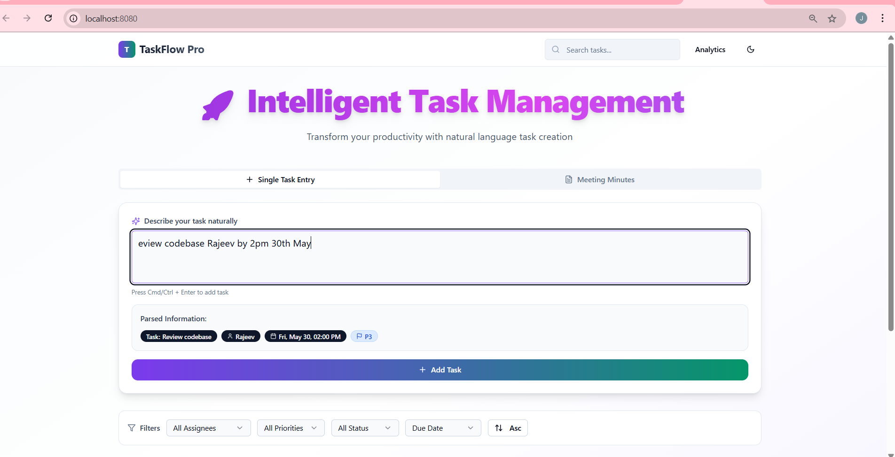
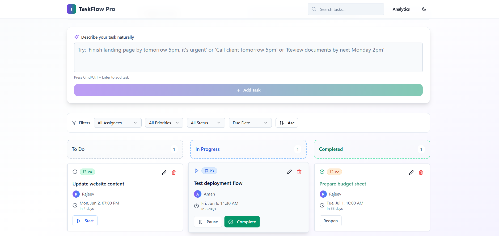

# TaskFlow Pro - Natural Language Task Manager

## Objective
Build a Web App that lets a user add natural language tasks like:
- "Finish landing page Aman by 11pm 20th June"
- "Call client Rajeev tomorrow 5pm"

## Functionality Requirements
- **Extract:**
  - **Task Name** (e.g., "Finish landing page")
  - **Assignee** (e.g., "Aman")
  - **Due Date & Time** (e.g., "11pm 20th June")
- **Default priority**: P3 unless specified as P1, P2, or P4
- **Display** the parsed task in a beautiful UI task board/list

## Overview

TaskFlow Pro is a modern, AI-powered task management application that leverages natural language processing to intelligently parse and organize your tasks. Simply type your task in plain English, and TaskFlow Pro will automatically extract key information like due dates, assignees, and priority levels.

## Demo





## Features

- **Natural Language Processing**: Enter tasks in plain English (e.g., "Finish the report for Sarah by next Friday at 3pm with high priority").
- **Smart Date Handling**: Automatically sets dates to the future when no year is specified.
- **Priority Management**: Automatically assigns and color-codes priority levels (P1-P4).
- **Task Filtering**: Filter tasks by assignee, priority, status, or search terms.
- **Task Sorting**: Sort by due date, priority, or assignee.
- **Comprehensive Task Editing**: Edit all task properties with an intuitive modal interface.
- **Responsive Design**: Works beautifully on both desktop 
- **Modern UI**: Clean design with smooth animations and transitions.
- **Dark Mode**: Beautiful dark theme for night owls.

## Technology Stack

- **Frontend**: React with TypeScript
- **Styling**: TailwindCSS for responsive design
- **State Management**: React Hooks and Context API
- **AI Integration**: OpenAI API (optional)
- **Routing**: React Router
- **Build Tool**: Vite
- **UI Library**: shadcn-ui

## Getting Started

### Prerequisites

- Node.js (v16 or higher)
- npm

### Installation

```bash
# Clone the repository
git clone <YOUR_GIT_URL>
cd <YOUR_PROJECT_NAME>

# Install dependencies
npm install

# Start the development server
npm run dev
```

### OpenAI API Configuration (Optional)

TaskFlow Pro can use OpenAI's GPT model for enhanced natural language processing. To enable this feature:

1. Create a `.env` file in the project root
2. Add your OpenAI API key:  
   ```
   VITE_OPENAI_API_KEY=your_api_key_here
   ```

If no API key is provided, TaskFlow Pro will automatically fall back to its built-in NLP parser.

## Usage

### Single Task Entry
1. Click the "Add Task" button to create a new task.
2. Type your task in natural language (e.g., "Call John about the project proposal tomorrow at 2pm").
3. TaskFlow Pro will automatically extract the title, assignee, due date, and priority.
4. Press Ctrl+Enter or click Submit to add the task.


## Key Components

- **TaskInput**: Handles natural language input and parsing for single tasks.
- **TaskBoard**: Displays and manages tasks in a Kanban-style board.
- **TaskCard**: Displays individual tasks with editing capabilities.
- **TaskFilters**: Provides filtering and sorting options.
- **NLP Parser**: Local natural language processing.
- **OpenAI Service**: Integration with OpenAI API for enhanced parsing.

## Acknowledgments

- [OpenAI](https://openai.com/) for their powerful language models
- [React](https://reactjs.org/) and [Vite](https://vitejs.dev/) for the frontend framework
- [TailwindCSS](https://tailwindcss.com/) for the styling

---

Created by Jyothsna M  
Feel free to contribute or open issues!
